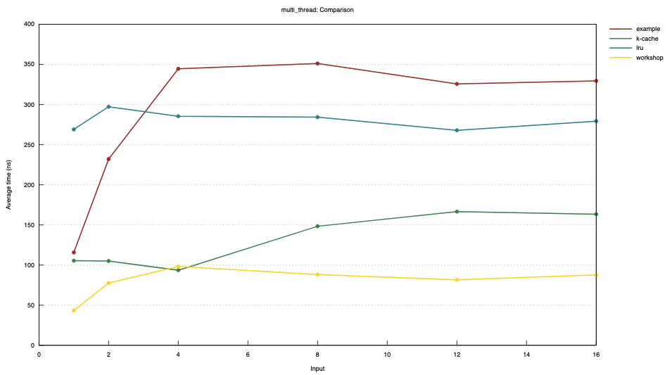

# Benchmarking


Though the traditional Rust benchmarking utility relies heavily on color, there are ways to
do these comparisons without depending on color vision. PR's to Criterion to improve the
visualizations would improve many lives :-). It is tough for my eyes to see, but the `lru`
and `example` lines are up top, while the `k-cache` and `workshop` lines are near the bottom.

The `multi_thread` benchmark image above shows a comparison of cache interaction latency
up the Y axis, for increasing contending thread count along the X axis.

The benchmark is set up for a 4:1 read:write ratio over a working set that is 2x the size
of the caches. This is in the range of fairly realistic workflows.

# How to run benchmarks

To run the benchmarks, run this at the root of your workshop directory:
```
cargo bench --bench bench_main -- multi_thread
```
The output goes to [target/criterion](../target/criterion/multi_thread/report/index.html).
<details>
 <summary>OSX</summary>
Open the report in your web browser. From the repo root directory, run this:

<code>
open target/criterion/report/index.html
</code>
</details>
<details>
 <summary>WSL</summary>
Open the report folder in the Explorer and double-click index.html. From the repo root
directory in a WSL terminal run this:

<code>
explorer.exe target/criterion/report
</code>

Remember that VS Code's integrated terminal is a WSL terminal, so you can easily run this
from the terminal in your editor.
</details>

# Your part
Your sieve cache is the `workshop` line. When you write your own sieve cache, you should see
it perform similarly to the `example` sieve cache line. It is the fastest in the screenshot
above because it is not implemented. No code is faster than no code!

# Interpretation and explanations
With a little effort, you can match the performance of the rigorous and high quality `moka`
library. The effort `moka` spends on maintaining the LRU algorithm eventually boils down to
something similar to a mutex. There is fancy work amortization and whatnot that makes `moka`'s
LRU implementation quite impressive, however it does eventually reach a point where it can't
squeeze any more throughput through it and you're reduced to approximately a mutex's throughput.

You can see that the `example` sieve cache and probably your `workshop` sieve cache perform in
the rough ballpark of `moka`. This is explained by the `cache::ShareableCache` which wraps both
the `example` cache and the `workshop` cache. The `ShareableCache` wrapper uses a mutex to make
it shareable, and that means you can't do better than a mutex with `ShareableCache`.

`lru` with the `moka` implementation does not require an external mutex for sharing. Neither does
the `k-cache` line. `k-cache` is a sharded implementation of sieve cache, for better parallelism.
Both of these cache implementations are suitable for a multi-threaded application. But to beat the
`lru` algorithm, `k-cache` needs only a couple hundred lines of code. `moka` is a feature-rich
cache, so its line count is not very relevant as a comparison. But it's worth noting that a simple
implementation of exactly what you need may be better suited to you than a generic implemtation of
what everyone needs!

# How to do better
## LRU
Profile:
```
CARGO_PROFILE_BENCH_DEBUG=true cargo bench \
  --bench bench_main -- --profile-time 5 --exact \
  'multi_thread/lru/1'
```
This outputs a flamegraph at `target/criterion/multi_thread/lru/1/flamegraph.svg`:


You can see the work that the `moka` crate does to achieve a high-performance lru implemantation.

## Sieve
```
CARGO_PROFILE_BENCH_DEBUG=true cargo bench \
  --bench bench_main -- --profile-time 5 --exact \
  'multi_thread/k-cache/1'
```
Here you can see how much less work a sharded sieve cache has to do to perform well at the same task.
There are still opportunities to improve, but it's better than lru at this kind of workload.


## Your implementation
```
CARGO_PROFILE_BENCH_DEBUG=true cargo bench \
  --bench bench_main -- --profile-time 5 --exact \
  'multi_thread/workshop/1'
```
Here you can see how your implementation compares, where it is spending its time. If your implementation
is not as quick as the example, you can see where you're spending time and address it.


# Going further
You can move on to comparing contended 16 thread workloads if you like, which gets a little more into the
art of concurrency. In here, you'll be looking for frames like `lock_contended` and queues which are used
to work around locking. The deeper you go, the more you will need to read and understand the source code
that you are profiling. At a high level, you can see where time is being spent and whether locks or queues
are used to communicate across threads.

When you seek to improve the latency of a workflow, sometimes you need to change the workflow's approach.
That's the idea of the sieve algorithm: Flip the concept of caching around - expire quickly and promote
lazily instead of promoting quickly and expiring lazily.

Sieve caching is not without its downsides, and a simple implementation is vulnerable to issues like
accessing the whole working set, then adding 1 element, and repeating. For many workflows that's not a
realistic concern, and most cache algorithms have some patterns that don't work well.

Stick to comparable workloads and compare your implementation against other cache implementations!

| profile | result |
| -- | -- |
| workshop |  |
| example |  |
| k-cache sieve |  |
| moka lru |  |
